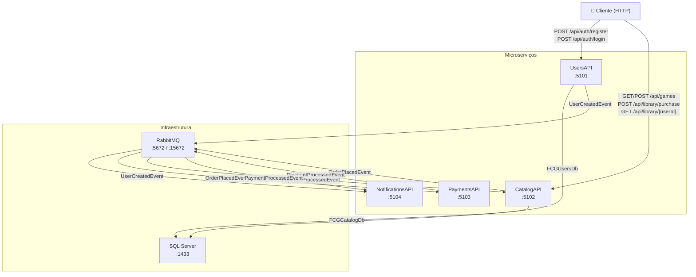
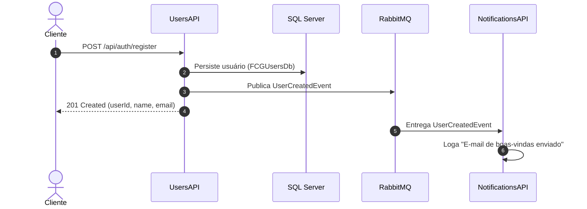
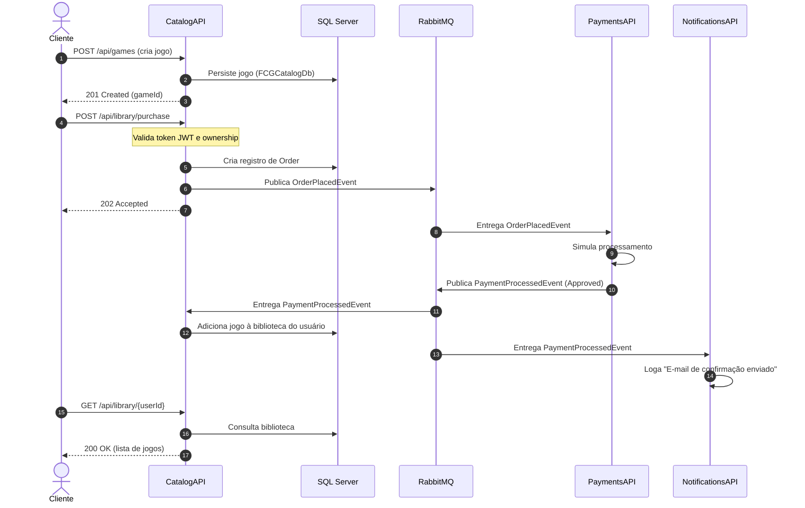
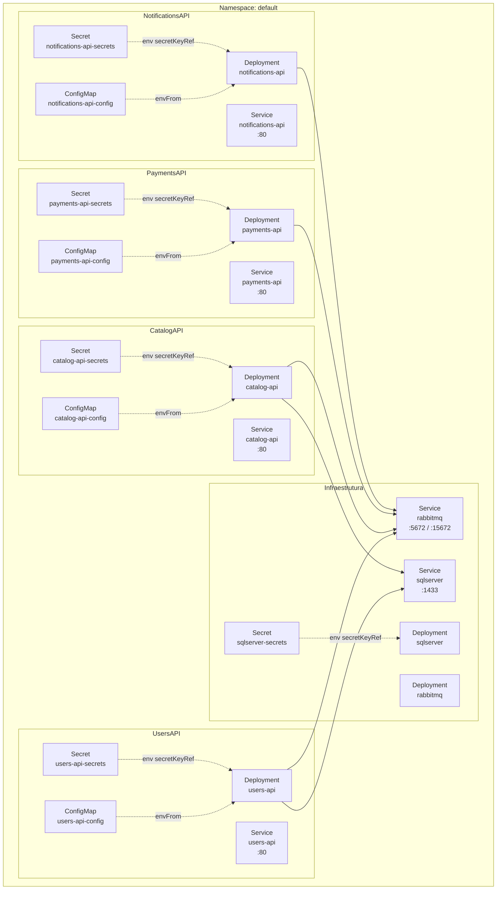

# FCG Orchestration

Repositório de orquestração da Fase 2 do Tech Challenge **FIAP Cloud Games (FCG)**.

Centraliza a execução local via **Docker Compose** e o deploy em **Kubernetes** dos quatro microserviços da plataforma, além da infraestrutura compartilhada (SQL Server e RabbitMQ).

---

## Microserviços

| Serviço | Responsabilidade | Porta local |
|---------|-----------------|-------------|
| **UsersAPI** | Cadastro, login, JWT e evento `UserCreatedEvent` | `5101` |
| **CatalogAPI** | Catálogo de jogos, compra, biblioteca e evento `OrderPlacedEvent` | `5102` |
| **PaymentsAPI** | Processamento simulado de pagamentos e evento `PaymentProcessedEvent` | `5103` |
| **NotificationsAPI** | Notificações simuladas via logs (Serilog) | `5104` |

---

## Repositórios Individuais

- [FCG-UsersAPI](https://github.com/posgraduacaofiapnet/FCG-UsersAPI)
- [FCG-CatalogAPI](https://github.com/posgraduacaofiapnet/FCG-CatalogAPI)
- [FCG-PaymentsAPI](https://github.com/posgraduacaofiapnet/FCG-PaymentsAPI)
- [FCG-NotificationsAPI](https://github.com/posgraduacaofiapnet/FCG-NotificationsAPI)
- [FCG-Orchestration](https://github.com/posgraduacaofiapnet/FCG-Orchestration) *(este repositório)*

---

## Tecnologias

- .NET 10 / ASP.NET Core
- Entity Framework Core 10
- SQL Server 2022
- JWT Bearer
- FluentValidation
- Swagger / OpenAPI
- MassTransit + RabbitMQ
- Serilog
- Docker / Docker Compose
- Kubernetes (kubectl)

---

## Arquitetura Geral



---

## Pré-requisitos

O `docker-compose.yml` **não** contém o código-fonte dos microserviços — cada serviço é construído a partir do seu próprio repositório, referenciado via `build.context: ../FCG-UsersAPI` (e equivalentes). Isso funciona apenas se os cinco repositórios estiverem clonados como **pastas irmãs**:

```
algum-diretorio/
├── FCG-Orchestration/     (este repositório)
├── FCG-UsersAPI/
├── FCG-CatalogAPI/
├── FCG-PaymentsAPI/
└── FCG-NotificationsAPI/
```

Clone os cinco repositórios lado a lado antes de continuar:

```bash
git clone https://github.com/posgraduacaofiapnet/FCG-Orchestration.git
git clone https://github.com/posgraduacaofiapnet/FCG-UsersAPI.git
git clone https://github.com/posgraduacaofiapnet/FCG-CatalogAPI.git
git clone https://github.com/posgraduacaofiapnet/FCG-PaymentsAPI.git
git clone https://github.com/posgraduacaofiapnet/FCG-NotificationsAPI.git
cd FCG-Orchestration
```

---

## Executando com Docker Compose

```bash
docker compose up --build
```

### URLs

| Serviço | URL |
|---------|-----|
| UsersAPI Swagger | http://localhost:5101/swagger |
| CatalogAPI Swagger | http://localhost:5102/swagger |
| PaymentsAPI Swagger | http://localhost:5103/swagger |
| NotificationsAPI Swagger | http://localhost:5104/swagger |
| RabbitMQ Management | http://localhost:15672 (`guest` / `guest`) |
| SQL Server | `localhost,1433` (`sa` / senha do compose) |

---

## Fluxo da Aplicação

### Fluxo de Cadastro



**Payload de cadastro:**

```json
{
  "name": "João Silva",
  "email": "joao@exemplo.com",
  "password": "Senha@123"
}
```

---

### Fluxo de Compra



**Payload de criação de jogo:**

```json
{
  "title": "Cyber FIAP",
  "description": "Jogo demo para o fluxo de compra.",
  "price": 99.90
}
```

**Payload de compra:**

```json
{
  "userId": "<guid-do-usuario>",
  "gameId": "<guid-do-jogo>"
}
```

**Consultar biblioteca:**

```http
GET http://localhost:5102/api/library/{userId}
Authorization: Bearer <token>
```

---

## Observabilidade e Correlation ID

Todos os quatro microserviços usam **Serilog** com saída em JSON estruturado no console. Cada entrada de log possui a propriedade `Service`, e os logs gerados dentro de uma requisição ou processamento de evento incluem `CorrelationId`.

O header HTTP adotado é `X-Correlation-ID`:

- Quando o cliente envia um valor válido, ele é preservado;
- Quando ausente ou com mais de 128 caracteres, a API gera um novo GUID;
- A API devolve o identificador no header da resposta;
- **UsersAPI** e **CatalogAPI** propagam o `CorrelationId` nos eventos publicados;
- **PaymentsAPI** preserva o identificador ao publicar o resultado;
- Os consumidores da **CatalogAPI** e **NotificationsAPI** enriquecem seus logs com o mesmo valor.

```bash
# Exemplo: rastrear uma operação com CorrelationId personalizado
curl -i -H "X-Correlation-ID: demo-compra-001" http://localhost:5102/api/games
docker compose logs | grep demo-compra-001
```

> Os logs **não** registram corpos de requisição, senhas, tokens JWT ou connection strings.

---

## Testes Unitários

Cada microserviço possui um projeto **xUnit** em `/tests`, com fixtures reutilizáveis e dados gerados pelo **Bogus**. UsersAPI e CatalogAPI usam o provider **InMemory** do Entity Framework Core para isolar as regras de persistência.

```bash
dotnet test ../FCG-UsersAPI/FCG-UsersAPI.sln
dotnet test ../FCG-CatalogAPI/FCG-CatalogAPI.sln
dotnet test ../FCG-PaymentsAPI/FCG-PaymentsAPI.sln
dotnet test ../FCG-NotificationsAPI/FCG-NotificationsAPI.sln
```

---

## Kubernetes

Esta seção descreve em detalhes como o projeto é estruturado e deployado em um cluster Kubernetes local.

### Visão Geral dos Recursos Utilizados

| Recurso K8s | Uso no projeto |
|-------------|----------------|
| **Deployment** | Gerencia os Pods de cada serviço. Define réplicas, imagem Docker, variáveis de ambiente, probes e estratégia de atualização. |
| **Service** | Expõe cada Pod internamente no cluster (ClusterIP). Permite que os serviços se comuniquem pelo nome DNS (`catalog-api`, `rabbitmq`, etc). |
| **ConfigMap** | Armazena configurações não-sensíveis: hostname do RabbitMQ, usernames, nomes de filas, JWT issuer/audience. |
| **Secret** | Armazena dados sensíveis codificados em base64: connection strings do SQL Server, JWT Key, senhas do RabbitMQ. Referenciados no Deployment via `secretKeyRef`. |
| **ReadinessProbe** | O Kubernetes só envia tráfego ao Pod após o endpoint `/health` responder com sucesso. Evita requisições durante inicialização. |
| **LivenessProbe** | O Kubernetes reinicia o Pod automaticamente se o `/health` parar de responder, garantindo auto-recuperação. |

---

### Topologia do Cluster



---

### Estrutura dos Manifestos

```
FCG-Orchestration/
└── k8s/                         ← Infra compartilhada
    ├── rabbitmq.yaml             ← Deployment + Service do RabbitMQ
    ├── sqlserver.yaml            ← Deployment + Service do SQL Server
    └── sqlserver-secrets.yaml   ← Secret com a senha SA do SQL Server

FCG-UsersAPI/
└── k8s/
    ├── deployment.yaml
    ├── service.yaml
    ├── configmap.yaml
    └── secret.yaml

FCG-CatalogAPI/
└── k8s/
    ├── deployment.yaml
    ├── service.yaml
    ├── configmap.yaml
    └── secret.yaml

FCG-PaymentsAPI/
└── k8s/
    ├── deployment.yaml
    ├── service.yaml
    ├── configmap.yaml
    └── secret.yaml

FCG-NotificationsAPI/
└── k8s/
    ├── deployment.yaml
    ├── service.yaml
    ├── configmap.yaml
    └── secret.yaml
```

---

### Deploy Passo a Passo

> **Importante:** O `kubectl apply -f .` deve ser executado **dentro** da pasta `/k8s/` de cada repositório. O diretório raiz contém o `docker-compose.yml`, que não é um manifesto Kubernetes válido.

#### Passo 1 — Infra compartilhada (RabbitMQ + SQL Server)

```bash
cd FCG-Orchestration/k8s
kubectl apply -f .
```

Aguarde os pods de infra estarem `Running` antes de continuar:

```bash
kubectl get pods -w
```

#### Passo 2 — Build das imagens dos microserviços

Execute os builds a partir da **raiz de cada repositório** (não da pasta `/k8s/`):

```bash
# UsersAPI
cd FCG-UsersAPI
docker build -t fcg-users-api:latest -f services/UsersAPI/Dockerfile .

# CatalogAPI
cd ../FCG-CatalogAPI
docker build -t fcg-catalog-api:latest -f services/CatalogAPI/Dockerfile .

# PaymentsAPI
cd ../FCG-PaymentsAPI
docker build -t fcg-payments-api:latest -f services/PaymentsAPI/Dockerfile .

# NotificationsAPI
cd ../FCG-NotificationsAPI
docker build -t fcg-notifications-api:latest -f services/NotificationsAPI/Dockerfile .
```

#### Passo 3 — Deploy dos microserviços

```bash
cd FCG-UsersAPI/k8s
kubectl apply -f .

cd ../../FCG-CatalogAPI/k8s
kubectl apply -f .

cd ../../FCG-PaymentsAPI/k8s
kubectl apply -f .

cd ../../FCG-NotificationsAPI/k8s
kubectl apply -f .
```

#### Passo 4 — Verificar o cluster

```bash
# Listar todos os pods e seus status
kubectl get pods

# Visualização detalhada com node e IP
kubectl get pods -o wide

# Listar todos os services e suas portas
kubectl get services

# Ver eventos recentes do cluster (útil para debug)
kubectl get events --sort-by='.lastTimestamp'
```

Todos os Pods devem ter status `Running` e `READY 1/1`.

#### Passo 5 — Acessar os serviços via port-forward

Em terminais separados, execute:

```bash
kubectl port-forward service/users-api 5101:80
kubectl port-forward service/catalog-api 5102:80
kubectl port-forward service/payments-api 5103:80
kubectl port-forward service/notifications-api 5104:80
```

| Serviço | Swagger |
|---------|---------|
| UsersAPI | http://localhost:5101/swagger |
| CatalogAPI | http://localhost:5102/swagger |
| PaymentsAPI | http://localhost:5103/swagger |
| NotificationsAPI | http://localhost:5104/swagger |

---

### Comandos Úteis de Diagnóstico

```bash
# Descrever um pod específico (ver eventos, probes, erros)
kubectl describe pod <nome-do-pod>

# Ver logs de um deployment
kubectl logs -f deployment/users-api
kubectl logs -f deployment/catalog-api
kubectl logs -f deployment/payments-api
kubectl logs -f deployment/notifications-api

# Ver logs com filtro (requer kubectl com jq)
kubectl logs deployment/catalog-api | grep "OrderPlaced"

# Reiniciar um deployment (útil após atualizar imagem)
kubectl rollout restart deployment/catalog-api

# Remover todos os recursos de um serviço
kubectl delete -f FCG-CatalogAPI/k8s/

# Remover toda a infra
kubectl delete -f FCG-Orchestration/k8s/
```

---

### Fluxo de Comunicação no Cluster

No Kubernetes, os serviços se comunicam pelo **nome DNS do Service** — não por localhost ou IP fixo. Por exemplo:

- A **CatalogAPI** conecta ao RabbitMQ via hostname `rabbitmq` (nome do Service)
- A **UsersAPI** conecta ao SQL Server via `sqlserver,1433` (nome do Service + porta)

Isso é configurado nos **ConfigMaps** e **Secrets** de cada serviço e injetado como variáveis de ambiente nos containers do Deployment.

---

## Evidências para o Vídeo

- Demonstrar `docker compose up --build` e todos os containers subindo.
- Mostrar os Swaggers de todas as APIs.
- Executar o fluxo de cadastro e observar os logs da NotificationsAPI (`UserCreatedEvent`).
- Executar o fluxo de compra completo e observar logs da PaymentsAPI (`OrderPlacedEvent`) e NotificationsAPI (`PaymentProcessedEvent`).
- Demonstrar o deploy no cluster Kubernetes local:
  - Executar `kubectl apply -f .` dentro de cada pasta `/k8s/`.
  - Executar `kubectl get pods` e mostrar todos os Pods com status `Running`.
  - Demonstrar `kubectl port-forward` e acessar o Swagger de ao menos uma API.
  - Executar o fluxo de compra via Swagger e observar os logs com `kubectl logs`.
