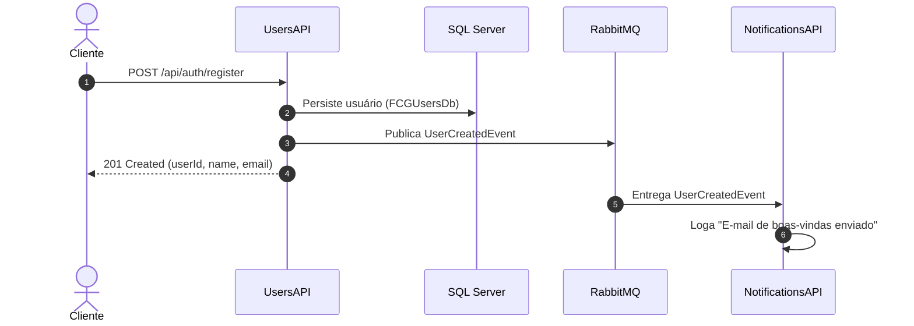
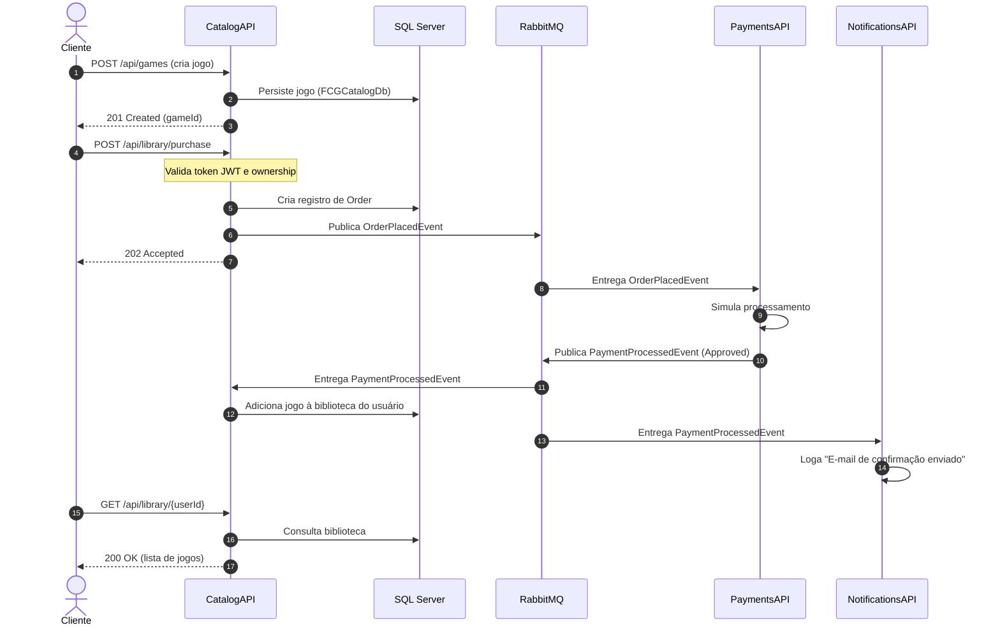
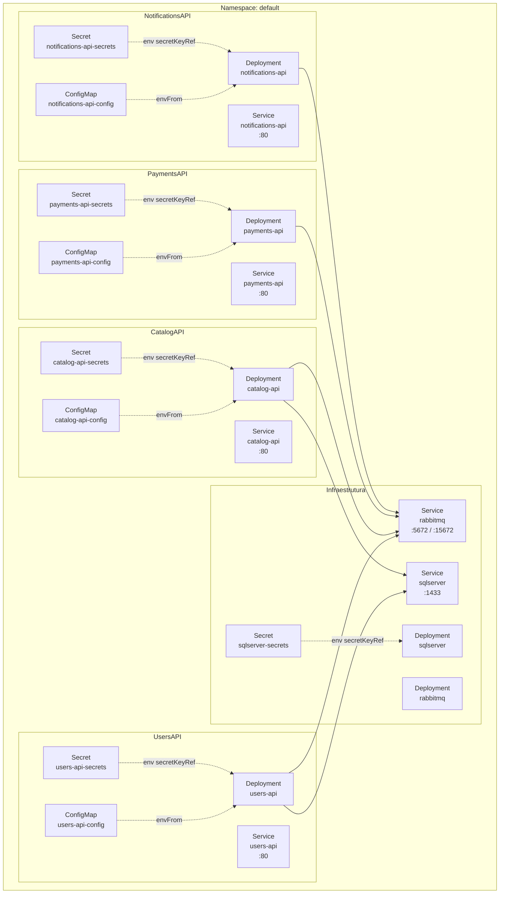

# FCG Orchestration

Repositório de orquestração da Fase 2 do Tech Challenge **FIAP Cloud Games (FCG)**.

Centraliza a execução local via **Docker Compose** e o deploy em **Kubernetes** dos quatro microserviços da plataforma, além da infraestrutura compartilhada (SQL Server e RabbitMQ).

---

## Microserviços

| Serviço | Responsabilidade | Porta local |
|---------|-----------------|-------------|
| **UsersAPI** | Cadastro, login, JWT e evento `UserCreatedEvent` | `5101` |
| **CatalogAPI** | Catálogo de jogos, compra, biblioteca e evento `OrderPlacedEvent` | `5102` |
| **PaymentsAPI** | Processamento simulado de pagamentos e evento `PaymentProcessedEvent` | `5103` |
| **NotificationsAPI** | Notificações simuladas via logs (Serilog) | `5104` |

---

## Repositórios Individuais

- [FCG-UsersAPI](https://github.com/posgraduacaofiapnet/FCG-UsersAPI)
- [FCG-CatalogAPI](https://github.com/posgraduacaofiapnet/FCG-CatalogAPI)
- [FCG-PaymentsAPI](https://github.com/posgraduacaofiapnet/FCG-PaymentsAPI)
- [FCG-NotificationsAPI](https://github.com/posgraduacaofiapnet/FCG-NotificationsAPI)
- [FCG-Orchestration](https://github.com/posgraduacaofiapnet/FCG-Orchestration) *(este repositório)*

---

## Tecnologias

- .NET 10 / ASP.NET Core
- Entity Framework Core 10
- SQL Server 2022
- JWT Bearer
- FluentValidation
- Swagger / OpenAPI
- MassTransit + RabbitMQ
- Serilog
- Docker / Docker Compose
- Kubernetes (kubectl)
- Prometheus & Grafana (Monitoramento e Observabilidade)
- Kong Gateway (DB-less)

---

## Pré-requisitos

O `docker-compose.yml` **não** contém o código-fonte dos microserviços — cada serviço é construído a partir do seu próprio repositório, referenciado via `build.context: ../FCG-UsersAPI` (e equivalentes). Isso funciona apenas se os cinco repositórios estiverem clonados como **pastas irmãs**:

```
algum-diretorio/
├── FCG-Orchestration/     (este repositório)
├── FCG-UsersAPI/
├── FCG-CatalogAPI/
├── FCG-PaymentsAPI/
└── FCG-NotificationsAPI/
```

Clone os cinco repositórios lado a lado antes de continuar:

```bash
git clone https://github.com/posgraduacaofiapnet/FCG-Orchestration.git
git clone https://github.com/posgraduacaofiapnet/FCG-UsersAPI.git
git clone https://github.com/posgraduacaofiapnet/FCG-CatalogAPI.git
git clone https://github.com/posgraduacaofiapnet/FCG-PaymentsAPI.git
git clone https://github.com/posgraduacaofiapnet/FCG-NotificationsAPI.git
cd FCG-Orchestration
```

---

## Executando com Docker Compose

```bash
docker compose up --build
```

### URLs

| Serviço | URL |
|---------|-----|
| UsersAPI Swagger | http://localhost:5101/swagger |
| CatalogAPI Swagger | http://localhost:5102/swagger |
| PaymentsAPI Swagger | http://localhost:5103/swagger |
| NotificationsAPI Swagger | http://localhost:5104/swagger |
| RabbitMQ Management | http://localhost:15672 (`guest` / `guest`) |
| SQL Server | `localhost,1433` (`sa` / senha do compose) |
| Prometheus | http://localhost:9090 |
| Grafana | http://localhost:3000 (`admin` / `admin`) |

---

## Usuário Administrador Padrão (Seed)

Ao inicializar o `UsersAPI`, um usuário administrador padrão é seedado automaticamente no banco de dados se não existir:

- **E-mail:** `admin@fcg.com`
- **Senha:** `AdminSenha@123`
- **Role:** `Admin`

Estas credenciais podem ser customizadas alterando as variáveis de ambiente `Admin__Email` e `Admin__Password` no `docker-compose.yml`.

## Fluxo da Aplicação

### Fluxo de Cadastro


```mermaid
sequenceDiagram
    autonumber
    actor Cliente
    participant UsersAPI
    participant SQLServer as SQL Server
    participant RabbitMQ
    participant NotificationsAPI

    Cliente->>UsersAPI: POST /api/auth/register
    UsersAPI->>SQLServer: Persiste usuário (FCGUsersDb)
    UsersAPI->>RabbitMQ: Publica UserCreatedEvent
    UsersAPI-->>Cliente: 201 Created (userId, name, email)
    RabbitMQ->>NotificationsAPI: Entrega UserCreatedEvent
    NotificationsAPI->>NotificationsAPI: Loga "E-mail de boas-vindas enviado"
```

**Payload de cadastro:**

```json
{
  "name": "João Silva",
  "email": "joao@exemplo.com",
  "password": "Senha@123"
}
```

---

### Fluxo de Compra


```mermaid
sequenceDiagram
    autonumber
    actor Cliente
    participant CatalogAPI
    participant SQLServer as SQL Server
    participant RabbitMQ
    participant PaymentsAPI
    participant NotificationsAPI

    Cliente->>CatalogAPI: POST /api/games (cria jogo)
    CatalogAPI->>SQLServer: Persiste jogo (FCGCatalogDb)
    CatalogAPI-->>Cliente: 201 Created (gameId)

    Cliente->>CatalogAPI: POST /api/library/purchase
    Note over CatalogAPI: Valida token JWT e ownership
    CatalogAPI->>SQLServer: Cria registro de Order
    CatalogAPI->>RabbitMQ: Publica OrderPlacedEvent
    CatalogAPI-->>Cliente: 202 Accepted

    RabbitMQ->>PaymentsAPI: Entrega OrderPlacedEvent
    PaymentsAPI->>PaymentsAPI: Simula processamento
    PaymentsAPI->>RabbitMQ: Publica PaymentProcessedEvent (Approved)

    RabbitMQ->>CatalogAPI: Entrega PaymentProcessedEvent
    CatalogAPI->>SQLServer: Adiciona jogo à biblioteca do usuário

    RabbitMQ->>NotificationsAPI: Entrega PaymentProcessedEvent
    NotificationsAPI->>NotificationsAPI: Loga "E-mail de confirmação enviado"

    Cliente->>CatalogAPI: GET /api/library/{userId}
    CatalogAPI->>SQLServer: Consulta biblioteca
    CatalogAPI-->>Cliente: 200 OK (lista de jogos)
```

**Payload de criação de jogo:**

```json
{
  "title": "Cyber FIAP",
  "description": "Jogo demo para o fluxo de compra.",
  "price": 99.90
}
```

**Payload de compra:**

```json
{
  "userId": "<guid-do-usuario>",
  "gameId": "<guid-do-jogo>"
}
```

**Consultar biblioteca:**

```http
GET http://localhost:5102/api/library/{userId}
Authorization: Bearer <token>
```

---

## Observabilidade e Correlation ID

Todos os quatro microserviços usam **Serilog** com saída em JSON estruturado no console. Cada entrada de log possui a propriedade `Service`, e os logs gerados dentro de uma requisição ou processamento de evento incluem `CorrelationId`.

O header HTTP adotado é `X-Correlation-ID`:

- Quando o cliente envia um valor válido, ele é preservado;
- Quando ausente ou com mais de 128 caracteres, a API gera um novo GUID;
- A API devolve o identificador no header da resposta;
- **UsersAPI** e **CatalogAPI** propagam o `CorrelationId` nos eventos publicados;
- **PaymentsAPI** preserva o identificador ao publicar o resultado;
- Os consumidores da **CatalogAPI** e **NotificationsAPI** enriquecem seus logs com o mesmo valor.

```bash
# Exemplo: rastrear uma operação com CorrelationId personalizado
curl -i -H "X-Correlation-ID: demo-compra-001" http://localhost:5102/api/games
docker compose logs | grep demo-compra-001
```

> Os logs **não** registram corpos de requisição, senhas, tokens JWT ou connection strings.

---

## Observabilidade e Monitoramento (Fase 3 - Opção A: Prometheus & Grafana)

Na Fase 3 do Tech Challenge, foi adotada a **Opção A: Stack de Código Aberto** com **Prometheus** e **Grafana** para o monitoramento contínuo da aplicação e saúde dos microsserviços.

### Justificativa da Escolha da Stack
- **Padrão de Mercado CNCF:** O Prometheus é o padrão de fato para coleta de métricas em ambientes de microsserviços e Kubernetes através de seu modelo pull eficiente.
- **Independência de Vendor Lock-in:** Solução 100% open source e auto-hospedada, sem custos de licença por host/métrica (em contraste com soluções comerciais como Datadog e New Relic).
- **Flexibilidade e Visualização Rica:** O Grafana permite criar painéis de controle dinâmicos, alertas configuráveis e suporte a provisionamento como código (IaC).

### Métricas Coletadas e Instrumentação
Os microsserviços **UsersAPI**, **CatalogAPI** e **PaymentsAPI** foram instrumentados utilizando a biblioteca `prometheus-net.AspNetCore`, expondo o endpoint `/metrics` em cada serviço.

As seguintes métricas são capturadas e analisadas:
1. **Latência de Requisições HTTP:**
   - Métrica: `http_request_duration_seconds` (Histograma).
   - Análise: Cálculo de percentis **p50 (mediana)**, **p95** e **p99**, além de tempo médio por endpoint e método.
2. **Contagem de Requisições (Throughput / RPS):**
   - Métrica: `http_requests_received_total` (Contador).
   - Análise: Taxa de requisições por segundo (`req/s`) agregada por serviço e rota.
3. **Distribuição por Código de Status HTTP:**
   - Métrica: `http_requests_received_total{code="..."}`.
   - Análise: Agrupamento em tempo real de requisições 2xx (Sucesso), 4xx (Erros de Cliente) e 5xx (Erros de Servidor).
4. **Taxa de Erros (%):**
   - Expressão PromQL: `(sum(rate(http_requests_received_total{code=~"4..|5.."}[1m])) / sum(rate(http_requests_received_total[1m]))) * 100`.
   - Permite identificar picos de anomalias imediatamente.
5. **Saúde dos Serviços:**
   - Métrica: `up{job=~"users-api|catalog-api|payments-api"}` para visualização de disponibilidade instantânea (UP/DOWN).

### Dashboard Grafana Pré-Configurado (Provisioning IaC)
O Grafana é provisionado automaticamente ao subir o container ou cluster:
- **Datasource:** Configurado automaticamente apontando para `http://prometheus:9090`.
- **Dashboard:** Disponível na pasta `FCG` sob o título **"FCG - Visão Geral do Sistema"** (`fcg-system-overview`).
- **Painéis Inclusos:**
  - **KPIs em Destaque:** Total de Requisições Processadas, Taxa de Erro Atual (%), Latência p95 Atual e Status dos Serviços.
  - **Gráfico de Latência:** Curvas temporais de p50, p95 e p99.
  - **Gráfico de Throughput:** Volume de tráfego por microsserviço.
  - **Gráfico de Status Codes:** Barras empilhadas dos códigos HTTP retornados.
  - **Gráfico de Taxa de Erros:** Evolução temporal de falhas 4xx e 5xx.

### Acesso Local
- **Prometheus:** [http://localhost:9090](http://localhost:9090) (Targets em *Status > Targets*)
- **Grafana:** [http://localhost:3000](http://localhost:3000) (Login: `admin` / Senha: `admin`)

---

## Testes Unitários

Cada microserviço possui um projeto **xUnit** em `/tests`, com fixtures reutilizáveis e dados gerados pelo **Bogus**. UsersAPI e CatalogAPI usam o provider **InMemory** do Entity Framework Core para isolar as regras de persistência.

```bash
dotnet test ../FCG-UsersAPI/FCG-UsersAPI.sln
dotnet test ../FCG-CatalogAPI/FCG-CatalogAPI.sln
dotnet test ../FCG-PaymentsAPI/FCG-PaymentsAPI.sln
dotnet test ../FCG-NotificationsAPI/FCG-NotificationsAPI.sln
```

---

## Kubernetes

Esta seção descreve em detalhes como o projeto é estruturado e deployado em um cluster Kubernetes local.

### Visão Geral dos Recursos Utilizados

| Recurso K8s | Uso no projeto |
|-------------|----------------|
| **Deployment** | Gerencia os Pods de cada serviço. Define réplicas, imagem Docker, variáveis de ambiente, probes e estratégia de atualização. |
| **Service** | Expõe cada Pod internamente no cluster (ClusterIP). Permite que os serviços se comuniquem pelo nome DNS (`catalog-api`, `rabbitmq`, etc). |
| **ConfigMap** | Armazena configurações não-sensíveis: hostname do RabbitMQ, usernames, nomes de filas, JWT issuer/audience. |
| **Secret** | Armazena dados sensíveis codificados em base64: connection strings do SQL Server, JWT Key, senhas do RabbitMQ. Referenciados no Deployment via `secretKeyRef`. |
| **ReadinessProbe** | O Kubernetes só envia tráfego ao Pod após o endpoint `/health` responder com sucesso. Evita requisições durante inicialização. |
| **LivenessProbe** | O Kubernetes reinicia o Pod automaticamente se o `/health` parar de responder, garantindo auto-recuperação. |

---

### Topologia do Cluster


```mermaid
graph TD
    subgraph "Namespace: default"
        subgraph "Infraestrutura"
            dep_rabbit["Deployment\nrabbitmq"]
            svc_rabbit["Service\nrabbitmq\n:5672 / :15672"]
            dep_sql["Deployment\nsqlserver"]
            svc_sql["Service\nsqlserver\n:1433"]
            sec_sql["Secret\nsqlserver-secrets"]
        end

        subgraph "UsersAPI"
            dep_users["Deployment\nusers-api"]
            svc_users["Service\nusers-api\n:80"]
            cm_users["ConfigMap\nusers-api-config"]
            sec_users["Secret\nusers-api-secrets"]
        end

        subgraph "CatalogAPI"
            dep_catalog["Deployment\ncatalog-api"]
            svc_catalog["Service\ncatalog-api\n:80"]
            cm_catalog["ConfigMap\ncatalog-api-config"]
            sec_catalog["Secret\ncatalog-api-secrets"]
        end

        subgraph "PaymentsAPI"
            dep_payments["Deployment\npayments-api"]
            svc_payments["Service\npayments-api\n:80"]
            cm_payments["ConfigMap\npayments-api-config"]
            sec_payments["Secret\npayments-api-secrets"]
        end

        subgraph "NotificationsAPI"
            dep_notif["Deployment\nnotifications-api"]
            svc_notif["Service\nnotifications-api\n:80"]
            cm_notif["ConfigMap\nnotifications-api-config"]
            sec_notif["Secret\nnotifications-api-secrets"]
        end
    end

    dep_users --> svc_rabbit
    dep_users --> svc_sql
    dep_catalog --> svc_rabbit
    dep_catalog --> svc_sql
    dep_payments --> svc_rabbit
    dep_notif --> svc_rabbit

    cm_users -.->|envFrom| dep_users
    sec_users -.->|env secretKeyRef| dep_users
    cm_catalog -.->|envFrom| dep_catalog
    sec_catalog -.->|env secretKeyRef| dep_catalog
    cm_payments -.->|envFrom| dep_payments
    sec_payments -.->|env secretKeyRef| dep_payments
    cm_notif -.->|envFrom| dep_notif
    sec_notif -.->|env secretKeyRef| dep_notif
    sec_sql -.->|env secretKeyRef| dep_sql
```

---

### Estrutura dos Manifestos

```
FCG-Orchestration/
└── k8s/                         ← Infra compartilhada
    ├── rabbitmq.yaml             ← Deployment + Service do RabbitMQ
    ├── sqlserver.yaml            ← Deployment + Service do SQL Server
    ├── sqlserver-secrets.yaml   ← Secret com a senha SA do SQL Server
    ├── gateway/                 ← Kong API Gateway (Fase 3)
    │   ├── kong-config.yaml
    │   ├── kong-deployment.yaml
    │   ├── kong-secret.yaml
    │   └── kong-service.yaml
    └── monitoring/              ← Stack de Observabilidade (Fase 3)
        ├── prometheus-configmap.yaml
        ├── prometheus.yaml
        ├── grafana-configmap.yaml
        ├── grafana-dashboards-configmap.yaml
        └── grafana.yaml

FCG-UsersAPI/
└── k8s/
    ├── deployment.yaml
    ├── service.yaml
    ├── configmap.yaml
    └── secret.yaml

FCG-CatalogAPI/
└── k8s/
    ├── deployment.yaml
    ├── service.yaml
    ├── configmap.yaml
    └── secret.yaml

FCG-PaymentsAPI/
└── k8s/
    ├── deployment.yaml
    ├── service.yaml
    ├── configmap.yaml
    └── secret.yaml

FCG-NotificationsAPI/
└── k8s/
    ├── deployment.yaml
    ├── service.yaml
    ├── configmap.yaml
    └── secret.yaml
```

---

### Deploy Passo a Passo

> **Importante:** O `kubectl apply -f .` deve ser executado **dentro** da pasta `/k8s/` de cada repositório. O diretório raiz contém o `docker-compose.yml`, que não é um manifesto Kubernetes válido.

O Kong Gateway é a porta de entrada das APIs expostas na Fase 3. Ele roteia requisições para UsersAPI e CatalogAPI e valida JWT nas rotas protegidas. PaymentsAPI e NotificationsAPI permanecem internos e seguem se comunicando por RabbitMQ.

#### Passo 1 — Infra compartilhada (RabbitMQ + SQL Server)

```bash
cd FCG-Orchestration/k8s
kubectl apply -f .
```

Aguarde os pods de infra estarem `Running` antes de continuar:

```bash
kubectl get pods -w
```

#### Passo 2 — Build das imagens dos microserviços

Execute os builds a partir da **raiz de cada repositório** (não da pasta `/k8s/`):

```bash
# UsersAPI
cd FCG-UsersAPI
docker build -t fcg-users-api:latest -f services/UsersAPI/Dockerfile .

# CatalogAPI
cd ../FCG-CatalogAPI
docker build -t fcg-catalog-api:latest -f services/CatalogAPI/Dockerfile .

# PaymentsAPI
cd ../FCG-PaymentsAPI
docker build -t fcg-payments-api:latest -f services/PaymentsAPI/Dockerfile .

# NotificationsAPI
cd ../FCG-NotificationsAPI
docker build -t fcg-notifications-api:latest -f services/NotificationsAPI/Dockerfile .
```

#### Passo 3 — Deploy dos microserviços

```bash
cd FCG-UsersAPI/k8s
kubectl apply -f .

cd ../../FCG-CatalogAPI/k8s
kubectl apply -f .

cd ../../FCG-PaymentsAPI/k8s
kubectl apply -f .

cd ../../FCG-NotificationsAPI/k8s
kubectl apply -f .
```

#### Passo 4 — Deploy do API Gateway (Kong)

```bash
cd ../../FCG-Orchestration/k8s/gateway
kubectl apply -f .
kubectl rollout status deployment/kong-gateway
```

#### Passo 5 — Deploy da Stack de Monitoramento (Prometheus & Grafana)

```bash
cd ../monitoring
kubectl apply -f .
```

#### Passo 6 — Verificar o cluster

```bash
# Listar todos os pods e seus status
kubectl get pods

# Visualização detalhada com node e IP
kubectl get pods -o wide

# Listar todos os services e suas portas
kubectl get services

# Ver eventos recentes do cluster (útil para debug)
kubectl get events --sort-by='.lastTimestamp'
```

Todos os Pods devem ter status `Running` e `READY 1/1`.

#### Passo 7 — Acessar o sistema

Em terminais separados, execute:

```bash
# Porta de entrada (Fase 3)
kubectl port-forward service/kong-gateway 8000:80

# APIs diretas (debug / Swagger)
kubectl port-forward service/users-api 5101:80
kubectl port-forward service/catalog-api 5102:80
kubectl port-forward service/payments-api 5103:80
kubectl port-forward service/notifications-api 5104:80

# Monitoramento e Observabilidade
kubectl port-forward service/prometheus 9090:9090
kubectl port-forward service/grafana 3000:3000
```

Use `http://localhost:8000` como origem das requisições externas:

- `POST /api/auth/register`
- `POST /api/auth/login`
- `GET /api/games`
- Operações protegidas em `/api/games` e `/api/library` com `Authorization: Bearer <token>`

O script `test.sh` usa essa origem por padrão. Para outro endereço do proxy, defina `GATEWAY_URL` antes de executá-lo.

| Serviço | URL | Credenciais |
|---------|-----|-------------|
| Kong Gateway | http://localhost:8000 | - |
| UsersAPI Swagger | http://localhost:5101/swagger | - |
| CatalogAPI Swagger | http://localhost:5102/swagger | - |
| PaymentsAPI Swagger | http://localhost:5103/swagger | - |
| NotificationsAPI Swagger | http://localhost:5104/swagger | - |
| Prometheus | http://localhost:9090 | - |
| Grafana | http://localhost:3000 | `admin` / `admin` |

### Configuração do Kong

O Kong executa em modo DB-less. As rotas e a política JWT estão no ConfigMap `k8s/gateway/kong-config.yaml`; um init container renderiza esse template em um volume temporário com a chave do Secret `k8s/gateway/kong-secret.yaml`, sem incluí-la no ConfigMap.

A chave do Kong deve ser a mesma usada pela UsersAPI para emitir tokens e pela CatalogAPI para validá-los. O Kong valida assinatura e expiração nas rotas protegidas, mas a CatalogAPI continua verificando o token e o dono de cada recurso.

---

### Comandos Úteis de Diagnóstico

```bash
# Descrever um pod específico (ver eventos, probes, erros)
kubectl describe pod <nome-do-pod>

# Ver logs de um deployment
kubectl logs -f deployment/users-api
kubectl logs -f deployment/catalog-api
kubectl logs -f deployment/payments-api
kubectl logs -f deployment/notifications-api

# Ver logs com filtro (requer kubectl com jq)
kubectl logs deployment/catalog-api | grep "OrderPlaced"

# Reiniciar um deployment (útil após atualizar imagem)
kubectl rollout restart deployment/catalog-api

# Remover todos os recursos de um serviço
kubectl delete -f FCG-CatalogAPI/k8s/

# Remover toda a infra
kubectl delete -f FCG-Orchestration/k8s/
```

---

### Fluxo de Comunicação no Cluster

No Kubernetes, os serviços se comunicam pelo **nome DNS do Service** — não por localhost ou IP fixo. Por exemplo:

- A **CatalogAPI** conecta ao RabbitMQ via hostname `rabbitmq` (nome do Service)
- A **UsersAPI** conecta ao SQL Server via `sqlserver,1433` (nome do Service + porta)

Isso é configurado nos **ConfigMaps** e **Secrets** de cada serviço e injetado como variáveis de ambiente nos containers do Deployment.

---

## Evidências para o Vídeo (Até 20 Minutos)

- **Execução e Containers:** Demonstrar `docker compose up --build` ou `kubectl get pods` com todos os componentes saudáveis.
- **Endpoints de Métricas:** Demonstrar a resposta do `/metrics` nos microsserviços instrumentados (UsersAPI e CatalogAPI).
- **Prometheus Targets:** Acessar `http://localhost:9090/targets` e comprovar que os targets das APIs estão com status `UP`.
- **Dashboard em Tempo Real no Grafana (Opção A - Entregável Obrigatório):**
  - Acessar `http://localhost:3000` (Grafana) no dashboard **FCG - Visão Geral do Sistema**.
  - Realizar requisições através do Swagger ou script de teste.
  - Mostrar em tempo real o incremento no gráfico de **Throughput (RPS)** e no contador total de requisições.
  - Exibir a variação do painel de **Latência (p50 / p95 / p99)**.
  - Provocar requisições com falha (ex: validação inválida ou 401/403) e demonstrar o gráfico de **Status Codes (4xx)** e o cálculo da **Taxa de Erros (%)**.
- **Fluxos de Negócio e EDA:**
  - Executar o fluxo de cadastro (`POST /api/auth/register`) e acompanhar logs da NotificationsAPI (`UserCreatedEvent`).
  - Executar o fluxo de compra e acompanhar logs da PaymentsAPI (`OrderPlacedEvent`) e NotificationsAPI (`PaymentProcessedEvent`).
- **Deploy no Kubernetes:**
  - Demonstrar `kubectl apply -f .` em cada diretório de serviço, em `FCG-Orchestration/k8s/gateway` e em `FCG-Orchestration/k8s/monitoring`.
  - Executar `kubectl get pods` comprovando status `Running` de todos os pods.
  - Demonstrar acesso via `kubectl port-forward` do Kong (`localhost:8000`) e do Grafana (`localhost:3000`).
